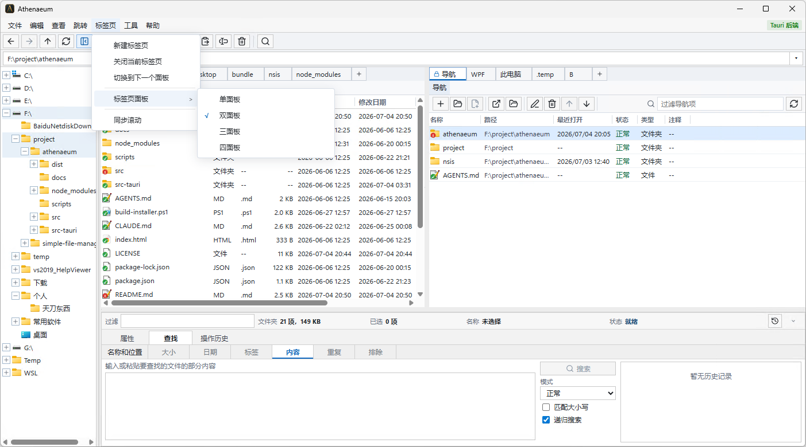

# Athenaeum 文件管理器

[](https://opensource.org/licenses/Apache-2.0)

**Athenaeum**（简单文件管理器）是一款面向 Windows 的开源桌面文件管理软件，基于 Tauri v2 + Rust + React + TypeScript 构建。

它在保留 Windows 原生使用习惯的基础上，提供更高效、更清晰的文件浏览与整理体验。无论是日常查看文件、批量整理目录，还是在多个位置之间快速切换，它都强调直接、稳定和高效率。

## 功能特性



- **多标签页浏览** — 像浏览器一样同时打开多个文件位置，减少频繁来回切换路径的成本
- **多面板工作区** — 支持单面板、双面板及更多面板布局，方便在不同目录之间对照、整理和移动文件
- **目录树导航** — 左侧目录树可快速展开和切换文件夹，适合在层级较深的目录中定位目标位置
- **多种查看方式** — 超大图标、大图标、中等图标、小图标、列表、详细信息、平铺、内容等八种视图模式
- **Windows 风格图标** — 文件、文件夹、磁盘等图标采用贴近 Windows 系统风格的显示效果
- **本地文件操作** — 浏览、复制、移动、重命名、删除、新建文件夹等日常管理操作
- **拖放整理** — 直接拖动文件到目标文件夹完成移动；按住 `Ctrl` 拖动执行复制
- **详细信息排序** — 在详细信息视图下按名称、类型、大小、修改时间等维度排序
- **此电脑视图** — 查看所有磁盘盘符，包括用量条和可用空间信息
- **原生右键菜单** — 支持 Windows 原生右键菜单与应用自定义右键菜单切换

## 技术栈

| 层 | 技术 |
|---|---|
| 桌面框架 | [Tauri v2](https://v2.tauri.app/) |
| 后端 | Rust |
| 前端 | React + TypeScript |
| 构建工具 | Vite / Rollup |

## 开发环境

### 前置要求

- [Node.js](https://nodejs.org/) >= 20
- [Rust](https://www.rust-lang.org/tools/install) (stable)
- [Tauri v2 CLI](https://v2.tauri.app/start/prerequisites/)

### 安装依赖

```bash
npm install
```

### 开发模式

```bash
npx tauri dev
```

### 构建

```bash
# 前端构建
npm run build

# 桌面应用打包
npx tauri build
```

### 测试

```bash
# 前端测试
npm test

# Rust 测试
npm run test:backend
```

## 项目地址

- **GitHub**: [https://github.com/xia117159/athenaeum](https://github.com/xia117159/athenaeum)

## 许可证

本项目基于 [Apache License 2.0](LICENSE) 开源。
